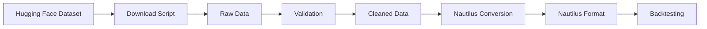

# Data Sources for Nautilus Trader

**Last Updated:** January 2025

---

## Primary Data Source: Hugging Face

### GotThatData/kraken-trading-data

**URL:** https://huggingface.co/datasets/GotThatData/kraken-trading-data

**Description:**
- Professional-quality historical trading data from Kraken exchange
- Pre-cleaned and validated OHLCV data
- Multiple trading pairs available
- Multiple timeframes (1m, 5m, 1h, 1d)
- No API rate limits
- Free to access and download

**Advantages:**
✅ Pre-cleaned (no "high < open" validation errors)  
✅ Professional quality data  
✅ No API rate limits  
✅ Fast download speeds  
✅ Multiple timeframes available  
✅ Historical data going back years  
✅ Easy to use with Python  

**Installation:**
```bash
pip install datasets
```

**Usage Example:**
```python
from datasets import load_dataset

# Load the dataset
dataset = load_dataset("GotThatData/kraken-trading-data")

# Explore available data
print(dataset)

# Filter for specific pairs and timeframes
eth_data = dataset.filter(lambda x: x['symbol'] == 'ETH/USD')
btc_data = dataset.filter(lambda x: x['symbol'] == 'BTC/USD')
```

**Download Script Location:**
```bash
# Will be created at:
/home/ajk/Nautilus/nautilus_trader/scripts/download_huggingface_data.py
```

---

## Alternative Data Sources

### 1. CCXT Direct Download

**When to Use:**
- Need very recent data (last few days)
- Need specific pairs not in Hugging Face
- Need data from exchanges other than Kraken

**Advantages:**
- Real-time and recent data
- Access to 100+ exchanges
- Can customize exactly what you need

**Disadvantages:**
- Rate limited by exchange APIs
- May have data quality issues (needs cleaning)
- Slower downloads
- API authentication may be required

**Script Location:**
```bash
/home/ajk/Nautilus/nautilus_trader/scripts/download_historical_data.py
```

**Status:** CCXT v4.5.7 installed and tested with 6 working exchanges

---

### 2. Other Hugging Face Datasets

**Search Terms:**
- "crypto trading data"
- "binance historical data"
- "coinbase trading data"
- "cryptocurrency ohlcv"

**How to Find:**
```bash
# Visit Hugging Face datasets
https://huggingface.co/datasets

# Search for crypto trading datasets
# Many community-contributed datasets available
```

**Popular Datasets:**
- Binance historical data collections
- Coinbase Pro historical data
- Multi-exchange aggregated datasets

---

### 3. Exchange Direct Downloads

**Binance:**
- Historical data: https://data.binance.vision/
- Spot, futures, options data available
- Monthly archives in CSV format

**Coinbase:**
- Historical data via API
- Professional (Pro) account may be needed

**Kraken:**
- REST API historical data
- CSV downloads available
- Requires API key for bulk downloads

---

## Data Directory Structure

```
data/
├── raw/                          # Downloaded raw data
│   ├── huggingface/              # From Hugging Face datasets
│   │   ├── kraken/
│   │   │   ├── ETH-USD-1h.parquet
│   │   │   ├── BTC-USD-1h.parquet
│   │   │   └── ...
│   │   └── other_datasets/
│   ├── ccxt/                     # From CCXT downloads
│   │   ├── kraken/
│   │   ├── okx/
│   │   └── ...
│   └── exchange_direct/          # Direct from exchanges
│       ├── binance/
│       └── ...
│
├── cleaned/                      # Validated and cleaned data
│   ├── ETH-USD-1h-cleaned.parquet
│   ├── BTC-USD-1h-cleaned.parquet
│   └── ...
│
└── nautilus/                     # Nautilus-formatted data
    ├── ETH-USD-1h-nautilus.parquet
    ├── BTC-USD-1h-nautilus.parquet
    └── ...
```

---

## Data Quality Checklist

When validating any data source, verify:

### OHLCV Integrity
- [ ] High >= Open
- [ ] High >= Close
- [ ] Low <= Open
- [ ] Low <= Close
- [ ] High >= Low
- [ ] No zero or negative values
- [ ] Volume is non-negative

### Timestamp Integrity
- [ ] No duplicate timestamps
- [ ] No large gaps (missing bars)
- [ ] Timestamps are sequential
- [ ] Correct timezone (UTC recommended)

### Data Completeness
- [ ] All required columns present
- [ ] No null/NaN values in critical fields
- [ ] Sufficient historical depth for backtesting

---

## Recommended Data Pipeline



**Steps:**
1. **Download** from Hugging Face (primary) or CCXT (alternative)
2. **Validate** OHLCV integrity and timestamps
3. **Clean** any issues (remove invalid bars, fill gaps)
4. **Convert** to Nautilus format (Parquet files)
5. **Backtest** with Nautilus Trader

---

## Scripts Overview

### scripts/download_huggingface_data.py
**Purpose:** Download data from Hugging Face datasets  
**Status:** TO CREATE  
**Priority:** HIGH

```bash
python scripts/download_huggingface_data.py \
  --dataset GotThatData/kraken-trading-data \
  --symbols ETH/USD,BTC/USD \
  --timeframes 1h,1d \
  --output data/raw/huggingface
```

### scripts/download_historical_data.py
**Purpose:** Download data via CCXT  
**Status:** TO CREATE  
**Priority:** MEDIUM (alternative to Hugging Face)

```bash
python scripts/download_historical_data.py \
  --exchange kraken \
  --symbols ETH/USD,BTC/USD \
  --timeframe 1h \
  --start 2024-01-01 \
  --end 2025-01-01
```

### scripts/clean_ohlcv_data.py
**Purpose:** Validate and clean OHLCV data  
**Status:** TO CREATE  
**Priority:** HIGH

```bash
python scripts/clean_ohlcv_data.py \
  --input data/raw/huggingface \
  --output data/cleaned \
  --validate \
  --fill-gaps
```

### scripts/convert_to_nautilus.py
**Purpose:** Convert cleaned data to Nautilus format  
**Status:** TO CREATE  
**Priority:** HIGH

```bash
python scripts/convert_to_nautilus.py \
  --input data/cleaned \
  --output data/nautilus \
  --format parquet
```

---

## Data Requirements for Backtesting

### Minimum Requirements
- **Time Period:** At least 6 months for meaningful results
- **Timeframe:** Match your strategy (1h for hourly strategies)
- **Quality:** Validated OHLCV with no gaps
- **Format:** Nautilus-compatible (will be converted)

### Recommended Requirements
- **Time Period:** 1-2 years for robust testing
- **Timeframes:** Multiple (1h, 1d for different strategies)
- **Pairs:** 2-5 major pairs (ETH/USD, BTC/USD, SOL/USD, etc.)
- **Validation:** Walk-forward optimization (12+ windows)

### For AI Strategy Testing
- **Time Period:** 2+ years (need train/test splits)
- **Timeframes:** 1h or 1d (for ML patterns)
- **Quality:** High-quality professional data (Hugging Face recommended)
- **Volume:** Sufficient for regime detection and clustering

---

## Storage Estimates

### Raw Data (1 year, 1h bars)
- Single pair: ~8,760 bars → ~1-2 MB
- 10 pairs: ~10-20 MB
- Multiple timeframes: ~50-100 MB

### Nautilus Format
- Slightly larger due to metadata
- Compressed Parquet: Similar to raw
- Uncompressed: 2-3x larger

### Total Storage Needed
- **Small setup** (1 pair, 1 year, 1 timeframe): ~10 MB
- **Medium setup** (5 pairs, 2 years, 2 timeframes): ~200 MB
- **Large setup** (20 pairs, 5 years, 4 timeframes): ~2-5 GB

---

## Next Steps

### Week 1: Data Pipeline
1. [ ] Install Hugging Face datasets library
2. [ ] Create download script for Hugging Face data
3. [ ] Download ETH/USD and BTC/USD (1 year, 1h bars)
4. [ ] Create validation/cleaning script
5. [ ] Create Nautilus conversion script
6. [ ] Test full pipeline with Tutorial 1

### Week 2: Expand Data
1. [ ] Download additional pairs (SOL/USD, ADA/USD, etc.)
2. [ ] Download multiple timeframes (1d, 4h, 1h)
3. [ ] Create data quality reports
4. [ ] Store in PostgreSQL for easy access

---

## Resources

### Hugging Face
- Main site: https://huggingface.co/
- Datasets: https://huggingface.co/datasets
- Documentation: https://huggingface.co/docs/datasets

### CCXT
- Documentation: https://docs.ccxt.com/
- Exchange list: https://github.com/ccxt/ccxt#supported-cryptocurrency-exchange-markets
- Rate limits: Check per exchange

### Nautilus Trader
- Data guide: https://nautilustrader.io/docs/latest/concepts/data/
- Data types: https://nautilustrader.io/docs/latest/api_reference/model/data/

---

**Primary Focus:** Start with GotThatData/kraken-trading-data from Hugging Face  
**Advantage:** Pre-cleaned, professional quality, no rate limits  
**Next Action:** Create download_huggingface_data.py script
